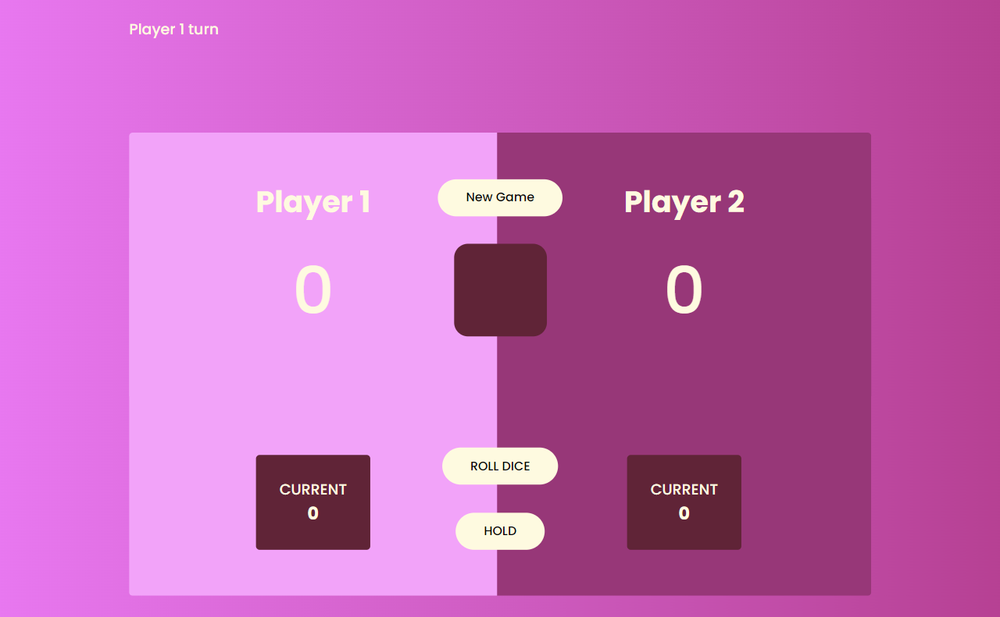

# Dice Game
- Live Site URL: [https://comforting-monstera-bafd70.netlify.app/](https://comforting-monstera-bafd70.netlify.app/)

# Screenshot

# Built with

-HTML
-SCSS
-TYPESCRIPT
-REACT

# Dice game rules

When it's a player's turn, he/she must click the roll dice button;

The number on the dice will be added to the player's current score;

The player decides if he/she will continue to roll the dice to add points to his current score or
if he/she will click the hold button, adding his current score to the total score(in this case
the other player's turn will follow);

If a player hits the number 1 on the dice, then he/she lose everything he/she has collected in the current score and it is the other player's turn;

The first player to reach the total score of 100 points will win;

To restart the game, click new game button.